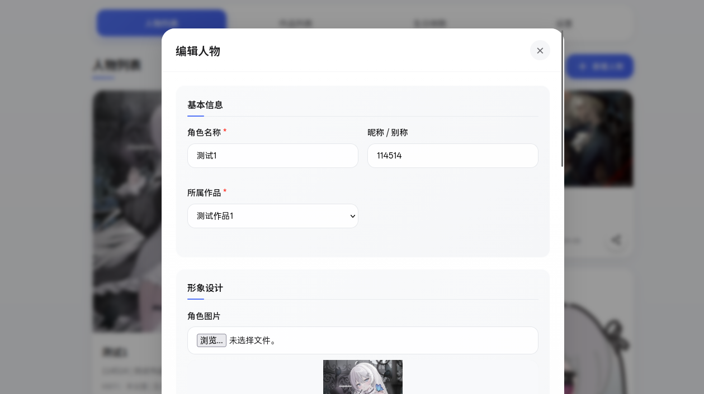
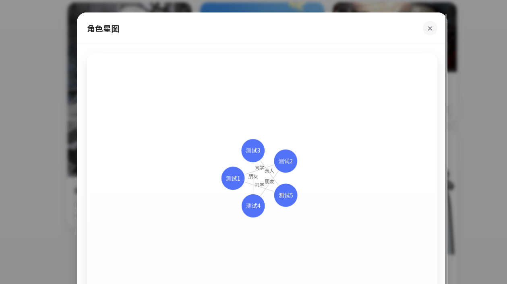

# MOEr

一个简洁美观的角色设计作品管理工具，支持瀑布流展示、多图上传、详情编辑和关系图谱可视化。专为 OCer 打造，帮助你高效管理和展示你的 OC 。

## ✨ 功能特性

- 🎨 **瀑布流展示**：自适应图片高度，完美展示不同比例的角色设计图
- 📸 **多图支持**：每个角色可上传多张设计图，内置轮播预览和大图查看
- 📝 **详情管理**：记录角色姓名、生日、简介、关系等详细信息
- 📊 **关系图谱**：可视化展示角色之间的关系网络
- 🎂 **生日提醒**：自动展示即将到来的角色生日
- 📱 **响应式设计**：完美适配桌面、平板和手机端
- ✨ **精美动效**：流畅的过渡动画和交互反馈
- 💾 **本地存储**：所有数据保存在浏览器本地，无需服务器

## 🛠️ 技术栈

- **前端**：纯 HTML + CSS + JavaScript
- **样式**：Tailwind CSS 风格的自定义 CSS
- **图标**：Font Awesome
- **存储**：浏览器 LocalStorage
- **可视化**：Canvas 绘制关系图谱

## 🚀 快速开始

### 直接使用

[项目传送门](https://teak75035.github.io/moer)

## 🎯 使用说明

### 添加角色

1. 点击页面右上角的「+ 添加角色」按钮
2. 填写角色基本信息（姓名、生日、简介等）
3. 上传角色设计图（支持多张）
4. 添加角色之间的关系
5. 点击「保存」完成添加

### 管理角色

- **查看详情**：点击任意角色卡片
- **编辑信息**：在详情页面点击「编辑」按钮
- **删除角色**：鼠标悬停在卡片上，点击右上角的删除按钮
- **查看关系**：点击卡片右下角的图谱图标，查看角色关系网络

### 导出/导入数据

- 前往「设置」页面
- 点击「导出数据」备份所有角色信息
- 点击「导入数据」恢复之前的备份

## 📸 截图预览


*瀑布流展示角色设计作品*


*角色详情页面*


*角色关系图谱*

## 📜 许可证

本项目采用 **GNU Affero General Public License v3.0 (AGPL-3.0)** 许可证。

```
Copyright (C) 2026 MOEr

This program is free software: you can redistribute it and/or modify
it under the terms of the GNU Affero General Public License as published
by the Free Software Foundation, either version 3 of the License, or
(at your option) any later version.

This program is distributed in the hope that it will be useful,
but WITHOUT ANY WARRANTY; without even the implied warranty of
MERCHANTABILITY or FITNESS FOR A PARTICULAR PURPOSE.  See the
GNU Affero General Public License for more details.

You should have received a copy of the GNU Affero General Public License
along with this program.  If not, see <https://www.gnu.org/licenses/>.
```

### AGPL-3.0 许可证说明

- ✅ 允许个人和商业使用
- ✅ 允许修改和分发
- ✅ 允许私有使用
- ❗ 如果你修改了代码并通过网络提供服务，必须公开你的修改
- ❗ 衍生作品必须使用相同的许可证
- ❗ 必须保留原作者的版权声明

## 🤝 贡献

欢迎提交 Issue 和 Pull Request 来帮助改进这个项目！

1. Fork 本仓库
2. 创建你的特性分支 (`git checkout -b feature/AmazingFeature`)
3. 提交你的修改 (`git commit -m 'Add some AmazingFeature'`)
4. 推送到分支 (`git push origin feature/AmazingFeature`)
5. 打开一个 Pull Request

## 📞 联系

如果你有任何问题或建议，欢迎通过以下方式联系：

- 提交 Issue：[GitHub Issues](https://github.com/teak75035/moer/issues)
- 邮箱：interls@163.com

## 🙏 致谢

感谢所有为这个项目做出贡献的人！

---

⭐ 如果这个项目对你有帮助，请给它一个 Star 支持一下！
